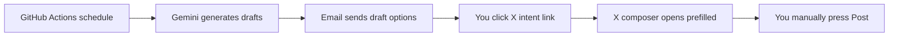

# Daily Tweet Draft Bot

A generic GitHub Actions bot that generates tweet drafts with Gemini and emails you review links.

It does **not** post directly to X/Twitter. Instead, each email includes an `https://x.com/intent/tweet` link that opens the X composer with the draft prefilled. You review the text and press **Post** yourself.

## Why this approach?

- No X API key is required.
- No X posting API cost is required.
- No X password or session cookies are stored.
- You keep final human approval before anything goes public.
- GitHub Actions can run the workflow daily on a schedule.

## How it works



## Setup

### 1. Create a Gemini API key

Create an API key from Google AI Studio:

<https://aistudio.google.com/app/apikey>

The default model is `gemini-3.1-flash-lite`, which is a good fit for lightweight daily drafting. If you want a stronger model, use `gemini-3.5-flash`.

### 2. Configure email sending

This project sends email through SMTP. Gmail works well if you create an app password.

For Gmail, typical settings are:

```text
SMTP_HOST=smtp.gmail.com
SMTP_PORT=587
SMTP_USE_TLS=true
SMTP_USERNAME=your-email@gmail.com
SMTP_PASSWORD=your-gmail-app-password
MAIL_FROM=your-email@gmail.com
MAIL_TO=where-you-want-drafts@example.com
```

### 3. Add GitHub repository secrets

In your GitHub repository, go to:

`Settings` → `Secrets and variables` → `Actions` → `Secrets`

Add these secrets:

| Secret | Description |
| --- | --- |
| `GEMINI_API_KEY` | Your Gemini API key |
| `SMTP_HOST` | SMTP server host |
| `SMTP_PORT` | SMTP server port, usually `587` |
| `SMTP_USERNAME` | SMTP login username |
| `SMTP_PASSWORD` | SMTP password or app password |
| `MAIL_FROM` | Sender email address |
| `MAIL_TO` | Recipient email address |

### 4. Add optional GitHub repository variables

Go to:

`Settings` → `Secrets and variables` → `Actions` → `Variables`

Add any of these variables:

| Variable | Default | Description |
| --- | --- | --- |
| `BOT_MODEL` | `gemini-3.1-flash-lite` | Gemini model. Use `gemini-3.5-flash` for a stronger model. |
| `BOT_TOPIC` | `one useful observation for builders, creators, or founders` | Daily topic |
| `BOT_STYLE` | `concise, clear, useful, and non-clickbait` | Writing style |
| `BOT_COUNT` | `3` | Number of draft options |
| `TWEET_MAX_CHARS` | `280` | Max tweet length |
| `EXTRA_INSTRUCTIONS` | empty | Extra prompt guidance |
| `SMTP_USE_TLS` | `true` | Use STARTTLS on SMTP |

### 5. Run manually once

Go to:

`Actions` → `Daily Tweet Draft` → `Run workflow`

You can optionally override the topic and style for that run.

### 6. Change the daily schedule

Edit `.github/workflows/daily-tweet-draft.yml`.

The default schedule is:

```yaml
- cron: "0 13 * * *"
```

GitHub cron schedules use UTC.

## Customizing for a niche

For example, a daily learning or productivity bot could use:

```text
BOT_TOPIC=one practical idea that helps people learn, build, create, or think more clearly
BOT_STYLE=clear, concise, encouraging, and useful without sounding like engagement bait
EXTRA_INSTRUCTIONS=Prefer evergreen advice. Avoid exaggerated claims, fake urgency, and generic motivational fluff.
```

For live news updates, add a separate data-gathering step before the Gemini call. Do not ask the model to invent current events without sources.

## Local test

Create a local `.env` from `.env.example`, export the variables into your shell, then run:

```bash
python scripts/generate_tweet_draft_email.py
```

No third-party Python packages are required.

## Notes

- This project generates drafts only; it does not automate posting.
- Clicking the X intent link opens the official X composer with text prefilled.
- You are responsible for reviewing accuracy, tone, and compliance before posting.
- Gemini API availability, quotas, and pricing can change. Check Google AI Studio for your account.
